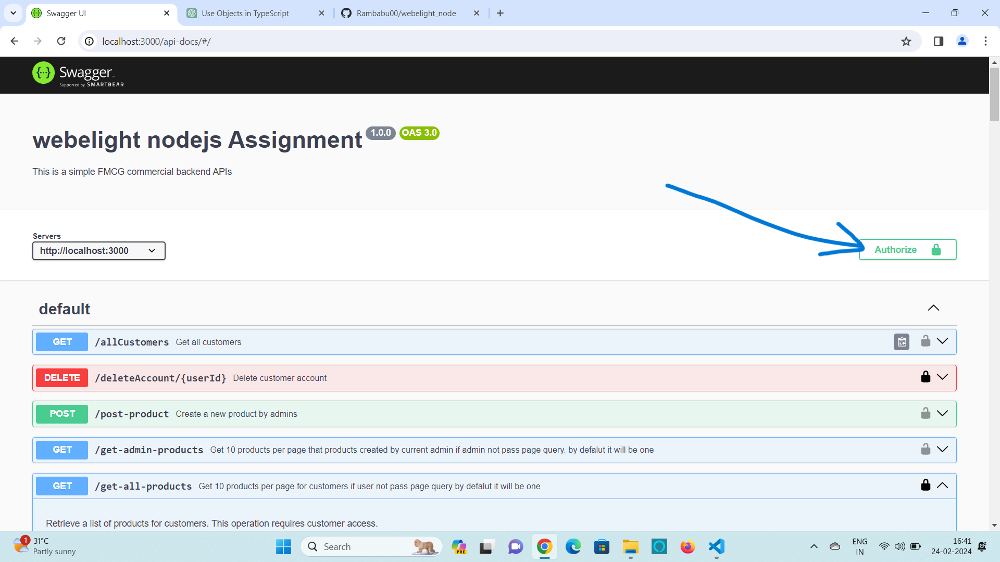
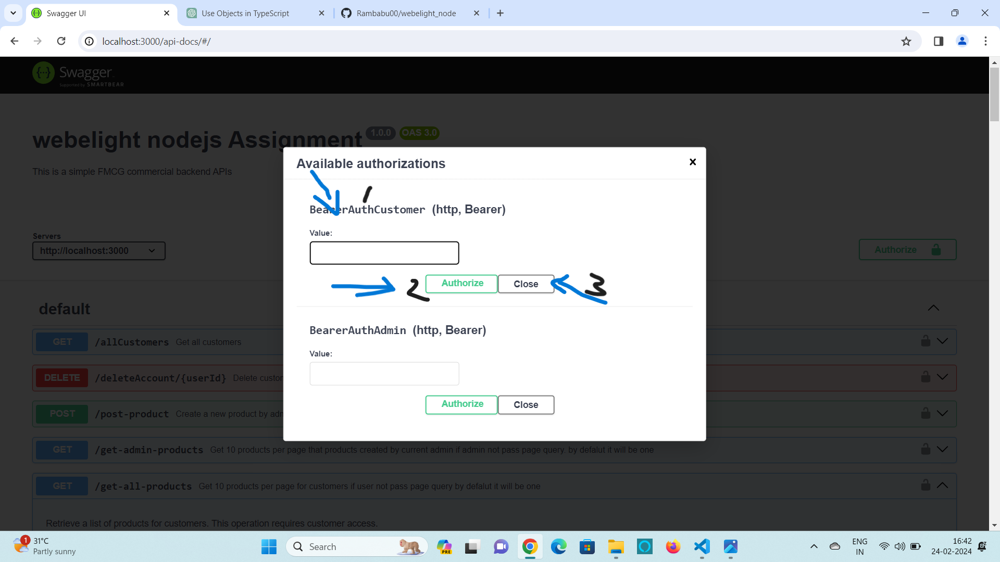

# Node.js/Express Application Devloped by using Typescript

This is a simple Node.js/Express in typescript FMCG commercial application  with Swagger documentation.

## Getting Started

### Prerequisites

- Node.js and npm installed on your machine

### Clone
1. Clone  my repository:
    using    
2. after clone my repo
### blow command for run server
    
    npm start
 
 1. After npm start command u will see blow things in command line

 The server will be running at http://localhost:3000.

Swagger Documentation
Access the Swagger documentation at http://localhost:3000/api-docs.

2. then just open chrome or any browser and paste this url--> http://localhost:3000/api-docs.
3. now u will see swagger ui.
4. this UI is for testing Apis and API endpoints
5. if u are entered authorization token but u getting authorization token missing error u need to enter token in Authorize the below image shows where u need to put token

6. based on access i mean if customer access required u put Authorization token in Authorize in BearerAuthCustomer the below image show where u need to put

 
 
